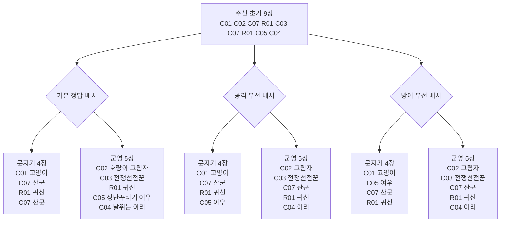
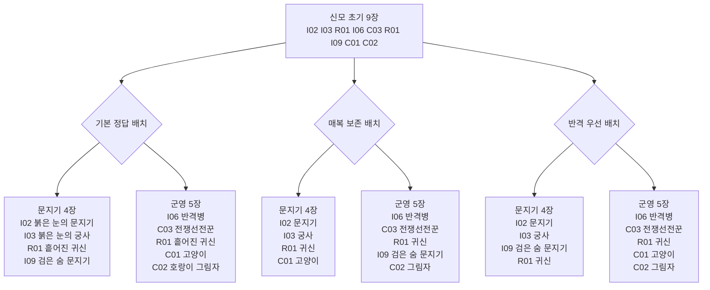
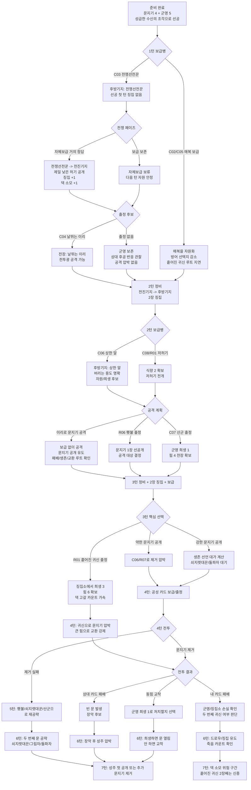
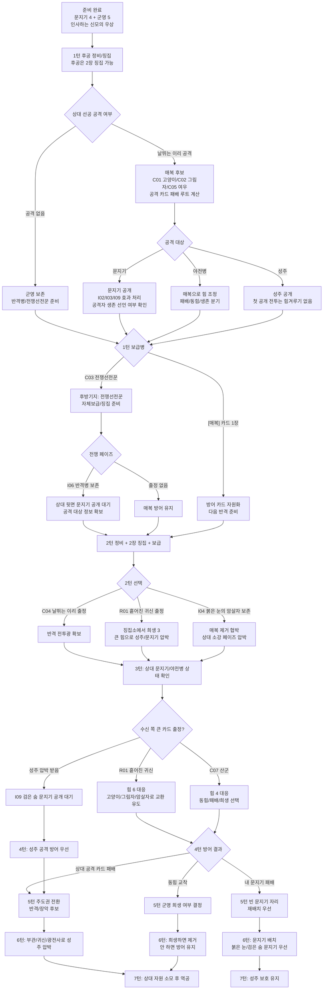
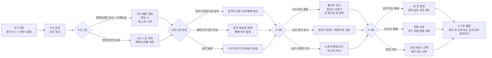

# 첫 성문 스타터 설계 초안

이 문서는 `첫 성문` 초보자용 카드풀을 고정 덱 순서 튜토리얼로 운용하기 위한 초안이다.

룰 기준점:

- 징집소는 40장으로 구성한다.
- 전쟁 시작 때 성주를 비공개로 배치한다.
- 시작 준비에서는 문지기 4장과 시작 군영 5장이 결정된다. 이 스타터에서는 고정 덱 순서를 쓰므로 처음 9장을 보고 문지기 4장과 군영 5장을 나누는 퍼즐로 다룬다.
- 선공은 첫 턴 징집 페이즈에 징집하지 않는다.
- 각 턴 보급병 배치 페이즈에 군영 카드 1장 또는 0장을 후방기지에 놓을 수 있다.
- 이 설계의 시뮬레이션 가정은 1~7턴 동안 매턴 가능한 한 보급병 1장을 내려놓는 것이다.
- [전투광]은 공격 선언 시 보급을 요구하지 않는다.
- [매복]은 방어자가 상대 공격 선언 후 군영에서 전장에 배치해 처리한다.
- [문지기 등장]은 비공개 문지기가 공개될 때 처리한다.
- [자체보급]은 해당 후방기지 카드를 전진기지로 옮기며 처리한다.

## 카드풀 30종

성주는 일반 카드와 같은 ST01 번호 안에 넣는다. 마지막 번호는 `GRNS-ST01-0030`이다.

- 공용 8종: 두 덱이 모두 사용한다.
- 수신의 길 전용 10종: `성급한 수신의 조각` 덱이 사용한다.
- 신모의 길 전용 10종: `인사하는 신모의 우상` 덱이 사용한다.
- 성주 2종: 덱 40장에는 넣지 않고 성주로 고정한다.

`C/R/I/H` 코드는 설계 중 역할을 빠르게 구분하기 위한 임시 코드다. 실제 카드 식별자는 모두 `GRNS-ST01-*` 시리얼을 사용한다.

### 공용 8종

| 코드 | 시리얼 | 카드명 | 허기/힘 | 종족 | 효과 | 역할 |
|---|---|---|---:|---|---|---|
| C01 | GRNS-ST01-0001 | 무시무시한 고양이 | 1/1 | 짐승 | [매복] 공격하는 카드의 힘 -1. 공격하는 카드가 <중립>이면 추가로 힘 -1. | 기본 방어 매복 |
| C02 | GRNS-ST01-0002 | 호랑이 그림자 | 2/2 | 도깨비 | [매복] 내 <중립> 카드 1장을 지정한다. 이번 전투 동안 힘 +2. | 전투 계산 보정 |
| C03 | GRNS-ST01-0003 | 전쟁선전꾼 | 1/1 | 인간 | [자체보급] 군영의 카드 1장을 [공개 1] 한다. 그렇게 했다면 징집 +1. | 자체보급, 공개, 징집 |
| C04 | GRNS-ST01-0004 | 날뛰는 이리 | 2/2 | 짐승 | [전투광] | 첫 공격 담당 |
| C05 | GRNS-ST01-0005 | 장난꾸러기 여우 | 2/1 | 짐승 | [매복] 이 카드를 포함한 내 <중립> 카드 1장을 지정한다. 이번 전투에서 공격 대상을 그 카드로 바꾼다. | 공격 대상 변경 |
| C06 | GRNS-ST01-0006 | 상한 알 | 3/1 | 알 | 효과 없음. | 보급/희생으로 버리는 카드 |
| C07 | GRNS-ST01-0007 | 허기진 산군 | 3/4 | 짐승 | [출정] 군영에서 [희생 1]. | 효율 유닛과 희생 |
| C08 | GRNS-ST01-0008 | 성문 앞 장정 | 3/3 | 인간 | 효과 없음. | 기준값 유닛 |

### 수신의 길 전용 10종

| 코드 | 시리얼 | 카드명 | 허기/힘 | 종족 | 효과 | 역할 |
|---|---|---|---:|---|---|---|
| R01 | GRNS-ST01-0009 | 흩어진 귀신 | 5/6 | 귀신 | [출정] 징집소에서 [희생 3]. | 고비용 압박과 덱 소모 |
| R02 | GRNS-ST01-0010 | 성급한 척후병 | 1/1 | 인간 | [출정] 이번 턴 내 다음 <중립> 출정 허기 -1. | 낮은 허기 전개 |
| R03 | GRNS-ST01-0011 | 돌멩이 투척수 | 1/1 | 인간 | 이 카드가 문지기를 공격할 때 힘 +1. | 초반 문지기 견제 |
| R04 | GRNS-ST01-0012 | 앞문 두드리는 병사 | 2/2 | 인간 | 성주 공격 시 힘 +1. | 성주 공격 예고 |
| R05 | GRNS-ST01-0013 | 급습하는 들개 | 2/1 | 짐승 | [전투광] 이 카드가 문지기를 공격할 때 힘 +1. | 전투광 응용 |
| R06 | GRNS-ST01-0014 | 북소리꾼 | 2/1 | 인간 | [출정] 내 전장의 <중립> 카드 1장을 지정한다. 이번 턴 동안 힘 +1. | 공격 보조 |
| R07 | GRNS-ST01-0015 | 길 여는 횃불 | 3/1 | 도구 | [출정] 상대 문지기 1장을 공개한다. | 문지기 정보 확인 |
| R08 | GRNS-ST01-0016 | 쇠지렛대꾼 | 3/3 | 인간 | 이 카드가 문지기를 공격할 때 힘 +1. | 중반 문지기 압박 |
| R09 | GRNS-ST01-0017 | 성벽 넘는 그림자 | 4/3 | 도깨비 | 상대 문지기 자리가 비어 있다면 성주 공격 시 힘 +2. | 빈 문 압박 |
| R10 | GRNS-ST01-0018 | 첫 성문 돌파자 | 6/6 | 인간 | 성주 공격 시 힘 +3. | 마무리 |

### 신모의 길 전용 10종

신모의 길은 방어만 하는 덱이 아니라, 붉은 눈 카드로 빠르게 길을 잡고 검은 숨 카드로 문지기를 교환해 <장악>으로 이기는 플랜을 가진다.

| 코드 | 시리얼 | 카드명 | 허기/힘 | 종족 | 효과 | 역할 |
|---|---|---|---:|---|---|---|
| I01 | GRNS-ST01-0019 | 붉은 눈의 선봉장 | 1/1 | 인간 | 이 카드는 <보급> 없이 <장악>할 수 있다. | 장악 핵심 |
| I02 | GRNS-ST01-0020 | 붉은 눈의 문지기 | 1/1 | 인간 | 이 카드는 공격할 수 없다. 문지기로 배치할 경우 힘 +2. | 초반 문지기 |
| I03 | GRNS-ST01-0021 | 붉은 눈의 궁사 | 2/2 | 인간 | [상시] 내 문지기 힘 +1. | 문지기 강화 |
| I04 | GRNS-ST01-0022 | 붉은 눈의 암살자 | 1/1 | 인간 | [매복] 상대 전장의 <중립> 카드 1장을 지정한다. 상대는 소강 페이즈에 징집소 아래부터 [희생 3]을 하거나 지정한 카드를 매장지로 이동해야 한다. | 지연 제거/덱 압박 |
| I05 | GRNS-ST01-0023 | 붉은 눈의 부관 | 1/1 | 인간 | 내 <중립> 카드가 문지기를 공격할 때 힘 +2. | 문지기 공격 보조 |
| I06 | GRNS-ST01-0024 | 검은 숨의 반격병 | 1/1 | 인간 | [매복] 상대의 뒷면인 문지기 1장을 지정한다. 앞면으로 뒤집는다. | 문지기 정보 공개 |
| I07 | GRNS-ST01-0025 | 검은 숨의 광전사 | 4/7 | 인간 | <징집소> 맨 아래에서부터 [희생 5]. | 성주 타격 세컨드 플랜 |
| I08 | GRNS-ST01-0026 | 검은 숨의 찬미자 | 1/1 | 인간 | [단말마] 2장을 징집한다. <군영>의 <검은 숨>을 포함하는 카드를 제외하고 매장지로 이동한다. | 검은 숨 재편 |
| I09 | GRNS-ST01-0027 | 검은 숨의 문지기 | 1/1 | 인간 | [매복] [문지기 등장] 내 다른 <중립> 문지기 1장을 지정한다. 그 카드를 매장지로 이동한다. 매장지로 이동했다면 상대의 공개 문지기를 매장지로 이동한다. | 문지기 교환 |
| I10 | GRNS-ST01-0028 | 검은 숨의 겁쟁이 | 1/1 | 인간 | [퇴각] 내 다른 전장의 <중립> 카드 1장을 지정한다. 이번 턴 힘 +1. | 퇴각 보조 |

### 성주 2종

| 코드 | 시리얼 | 카드명 | 허기/힘 | 종족 | 효과 |
|---|---|---|---:|---|---|
| H01 | GRNS-ST01-0029 | 성급한 수신의 조각 | 8/8 | 도구 | 이 카드는 <성주>에만 배치할 수 있다. 이 카드는 앞면으로 배치되어 시작한다. 이 성주를 사용하는 영령이 선공을 가져간다. 양쪽 영령이 모두 <성급한 수신의 조각>을 사용한다면 이 효과는 적용하지 않는다. |
| H02 | GRNS-ST01-0030 | 인사하는 신모의 우상 | 8/8 | 도구 | 이 카드는 <성주>에만 배치할 수 있다. [성주등장] 이 카드 공개 시 상대 영령과 인사합니다. |

## 덱 구성

각 덱은 기본적으로 공용 8종과 자기 전용 10종을 사용한다. 다만 신모의 길은 초반 문지기 방어를 키운 뒤 큰 카드로 전환하는 흐름을 보여주기 위해 `흩어진 귀신` 2장을 함께 사용한다. 덱별 고정 순서에 맞춰 일부 카드는 3장, 일부 카드는 1장으로 조정한다.

### 수신의 길

- 성주: GRNS-ST01-0029 성급한 수신의 조각
- 3장 채용: 전쟁선전꾼, 날뛰는 이리, 상한 알, 흩어진 귀신
- 2장 채용: 나머지 공용/수신 전용 카드

### 신모의 길

- 성주: GRNS-ST01-0030 인사하는 신모의 우상
- 3장 채용: 호랑이 그림자, 전쟁선전꾼, 붉은 눈의 문지기, 붉은 눈의 궁사, 검은 숨의 반격병
- 2장 채용: 흩어진 귀신, 붉은 눈의 선봉장, 붉은 눈의 부관, 나머지 주요 신모 카드
- 1장 채용: 날뛰는 이리, 성문 앞 장정, 붉은 눈의 암살자
- 기본 승리 플랜: 붉은 눈의 문지기와 궁사로 문지기 힘을 세우고, 반격병으로 상대 뒷면 문지기를 공개한 뒤 부관으로 문지기 공격을 밀어준다.
- 세컨드 플랜: 검은 숨의 광전사를 출정시켜 큰 덱 희생을 감수하고 성주를 직접 친다.

### 수신의 길 40장

| 시리얼 | 카드명 | 장수 |
|---|---|---:|
| GRNS-ST01-0001 | 무시무시한 고양이 | 2 |
| GRNS-ST01-0002 | 호랑이 그림자 | 2 |
| GRNS-ST01-0003 | 전쟁선전꾼 | 3 |
| GRNS-ST01-0004 | 날뛰는 이리 | 3 |
| GRNS-ST01-0005 | 장난꾸러기 여우 | 2 |
| GRNS-ST01-0006 | 상한 알 | 3 |
| GRNS-ST01-0007 | 허기진 산군 | 2 |
| GRNS-ST01-0008 | 성문 앞 장정 | 2 |
| GRNS-ST01-0009 | 흩어진 귀신 | 3 |
| GRNS-ST01-0010 | 성급한 척후병 | 2 |
| GRNS-ST01-0011 | 돌멩이 투척수 | 2 |
| GRNS-ST01-0012 | 앞문 두드리는 병사 | 2 |
| GRNS-ST01-0013 | 급습하는 들개 | 2 |
| GRNS-ST01-0014 | 북소리꾼 | 2 |
| GRNS-ST01-0015 | 길 여는 횃불 | 2 |
| GRNS-ST01-0016 | 쇠지렛대꾼 | 2 |
| GRNS-ST01-0017 | 성벽 넘는 그림자 | 2 |
| GRNS-ST01-0018 | 첫 성문 돌파자 | 2 |

고정 순서:

| 순서 | 시리얼 | 카드명 |
|---:|---|---|
| 1 | GRNS-ST01-0001 | 무시무시한 고양이 |
| 2 | GRNS-ST01-0002 | 호랑이 그림자 |
| 3 | GRNS-ST01-0007 | 허기진 산군 |
| 4 | GRNS-ST01-0009 | 흩어진 귀신 |
| 5 | GRNS-ST01-0003 | 전쟁선전꾼 |
| 6 | GRNS-ST01-0007 | 허기진 산군 |
| 7 | GRNS-ST01-0009 | 흩어진 귀신 |
| 8 | GRNS-ST01-0005 | 장난꾸러기 여우 |
| 9 | GRNS-ST01-0004 | 날뛰는 이리 |
| 10 | GRNS-ST01-0006 | 상한 알 |
| 11 | GRNS-ST01-0008 | 성문 앞 장정 |
| 12 | GRNS-ST01-0010 | 성급한 척후병 |
| 13 | GRNS-ST01-0013 | 급습하는 들개 |
| 14 | GRNS-ST01-0015 | 길 여는 횃불 |
| 15 | GRNS-ST01-0006 | 상한 알 |
| 16 | GRNS-ST01-0016 | 쇠지렛대꾼 |
| 17 | GRNS-ST01-0017 | 성벽 넘는 그림자 |
| 18 | GRNS-ST01-0012 | 앞문 두드리는 병사 |
| 19 | GRNS-ST01-0018 | 첫 성문 돌파자 |
| 20 | GRNS-ST01-0003 | 전쟁선전꾼 |
| 21 | GRNS-ST01-0001 | 무시무시한 고양이 |
| 22 | GRNS-ST01-0002 | 호랑이 그림자 |
| 23 | GRNS-ST01-0003 | 전쟁선전꾼 |
| 24 | GRNS-ST01-0004 | 날뛰는 이리 |
| 25 | GRNS-ST01-0005 | 장난꾸러기 여우 |
| 26 | GRNS-ST01-0009 | 흩어진 귀신 |
| 27 | GRNS-ST01-0008 | 성문 앞 장정 |
| 28 | GRNS-ST01-0006 | 상한 알 |
| 29 | GRNS-ST01-0010 | 성급한 척후병 |
| 30 | GRNS-ST01-0011 | 돌멩이 투척수 |
| 31 | GRNS-ST01-0011 | 돌멩이 투척수 |
| 32 | GRNS-ST01-0012 | 앞문 두드리는 병사 |
| 33 | GRNS-ST01-0013 | 급습하는 들개 |
| 34 | GRNS-ST01-0014 | 북소리꾼 |
| 35 | GRNS-ST01-0014 | 북소리꾼 |
| 36 | GRNS-ST01-0015 | 길 여는 횃불 |
| 37 | GRNS-ST01-0016 | 쇠지렛대꾼 |
| 38 | GRNS-ST01-0017 | 성벽 넘는 그림자 |
| 39 | GRNS-ST01-0018 | 첫 성문 돌파자 |
| 40 | GRNS-ST01-0004 | 날뛰는 이리 |

### 신모의 길 40장

| 시리얼 | 카드명 | 장수 |
|---|---|---:|
| GRNS-ST01-0001 | 무시무시한 고양이 | 2 |
| GRNS-ST01-0002 | 호랑이 그림자 | 3 |
| GRNS-ST01-0003 | 전쟁선전꾼 | 3 |
| GRNS-ST01-0004 | 날뛰는 이리 | 1 |
| GRNS-ST01-0005 | 장난꾸러기 여우 | 2 |
| GRNS-ST01-0006 | 상한 알 | 2 |
| GRNS-ST01-0007 | 허기진 산군 | 2 |
| GRNS-ST01-0008 | 성문 앞 장정 | 1 |
| GRNS-ST01-0009 | 흩어진 귀신 | 2 |
| GRNS-ST01-0019 | 붉은 눈의 선봉장 | 2 |
| GRNS-ST01-0020 | 붉은 눈의 문지기 | 3 |
| GRNS-ST01-0021 | 붉은 눈의 궁사 | 3 |
| GRNS-ST01-0022 | 붉은 눈의 암살자 | 1 |
| GRNS-ST01-0023 | 붉은 눈의 부관 | 2 |
| GRNS-ST01-0024 | 검은 숨의 반격병 | 3 |
| GRNS-ST01-0025 | 검은 숨의 광전사 | 2 |
| GRNS-ST01-0026 | 검은 숨의 찬미자 | 2 |
| GRNS-ST01-0027 | 검은 숨의 문지기 | 2 |
| GRNS-ST01-0028 | 검은 숨의 겁쟁이 | 2 |

고정 순서:

| 순서 | 시리얼 | 카드명 |
|---:|---|---|
| 1 | GRNS-ST01-0020 | 붉은 눈의 문지기 |
| 2 | GRNS-ST01-0021 | 붉은 눈의 궁사 |
| 3 | GRNS-ST01-0009 | 흩어진 귀신 |
| 4 | GRNS-ST01-0024 | 검은 숨의 반격병 |
| 5 | GRNS-ST01-0003 | 전쟁선전꾼 |
| 6 | GRNS-ST01-0009 | 흩어진 귀신 |
| 7 | GRNS-ST01-0027 | 검은 숨의 문지기 |
| 8 | GRNS-ST01-0001 | 무시무시한 고양이 |
| 9 | GRNS-ST01-0002 | 호랑이 그림자 |
| 10 | GRNS-ST01-0019 | 붉은 눈의 선봉장 |
| 11 | GRNS-ST01-0020 | 붉은 눈의 문지기 |
| 12 | GRNS-ST01-0006 | 상한 알 |
| 13 | GRNS-ST01-0021 | 붉은 눈의 궁사 |
| 14 | GRNS-ST01-0024 | 검은 숨의 반격병 |
| 15 | GRNS-ST01-0008 | 성문 앞 장정 |
| 16 | GRNS-ST01-0026 | 검은 숨의 찬미자 |
| 17 | GRNS-ST01-0003 | 전쟁선전꾼 |
| 18 | GRNS-ST01-0023 | 붉은 눈의 부관 |
| 19 | GRNS-ST01-0025 | 검은 숨의 광전사 |
| 20 | GRNS-ST01-0028 | 검은 숨의 겁쟁이 |
| 21 | GRNS-ST01-0002 | 호랑이 그림자 |
| 22 | GRNS-ST01-0005 | 장난꾸러기 여우 |
| 23 | GRNS-ST01-0019 | 붉은 눈의 선봉장 |
| 24 | GRNS-ST01-0020 | 붉은 눈의 문지기 |
| 25 | GRNS-ST01-0021 | 붉은 눈의 궁사 |
| 26 | GRNS-ST01-0022 | 붉은 눈의 암살자 |
| 27 | GRNS-ST01-0006 | 상한 알 |
| 28 | GRNS-ST01-0023 | 붉은 눈의 부관 |
| 29 | GRNS-ST01-0024 | 검은 숨의 반격병 |
| 30 | GRNS-ST01-0007 | 허기진 산군 |
| 31 | GRNS-ST01-0025 | 검은 숨의 광전사 |
| 32 | GRNS-ST01-0026 | 검은 숨의 찬미자 |
| 33 | GRNS-ST01-0027 | 검은 숨의 문지기 |
| 34 | GRNS-ST01-0028 | 검은 숨의 겁쟁이 |
| 35 | GRNS-ST01-0001 | 무시무시한 고양이 |
| 36 | GRNS-ST01-0002 | 호랑이 그림자 |
| 37 | GRNS-ST01-0003 | 전쟁선전꾼 |
| 38 | GRNS-ST01-0004 | 날뛰는 이리 |
| 39 | GRNS-ST01-0005 | 장난꾸러기 여우 |
| 40 | GRNS-ST01-0007 | 허기진 산군 |

## 초기 9장 준비 루트

수신의 길 첫 9장은 `C01 C02 C07 R01 C03 C07 R01 C05 C04`다.

신모의 길 첫 9장은 `I02 I03 R01 I06 C03 R01 I09 C01 C02`다.

## 1~7턴 루트 그래프

아래 그래프는 `매턴 보급병 1장 배치`를 전제로 한다. 이 스타터의 목적은 긴 장기전이 아니라, 초반에 보급병/자체보급/징집/희생을 거의 강제로 밟게 만들어 덱 소모 감각을 익히게 하는 것이다.

특히 수신의 길은 선공 첫 턴에 징집이 없으므로, `전쟁선전꾼`의 자체보급을 통해 1장 징집을 유도한다. 이 선택을 하지 않으면 선공은 초반 군영 폭이 좁아지고, 이후 `흩어진 귀신`을 내기 위한 자원과 희생 타이밍도 늦어진다.

이 설계에서 중요한 압박은 다음 세 가지다.

1. 시작 준비와 보급병 배치로 이미 징집소가 줄어든다.
2. `전쟁선전꾼`, `검은 숨의 찬미자` 같은 카드가 추가 징집을 유도한다.
3. `흩어진 귀신`은 징집소에서 [희생 3]을 요구하므로, 큰 힘을 얻는 대신 패배 조건인 징집소 고갈 카운트를 직접 앞당긴다.

따라서 루트는 `17턴 이상 버티는 장기전`보다 `1~7턴 사이에 얼마나 많이 당겨 쓰고, 어디서 공격을 패배/교환/성주 공개로 연결하느냐`를 보는 쪽으로 잡는다.

### 수신의 길 루트

### 신모의 길 루트

### 양 덱 대전 통합 루트

## 시뮬레이션 체크 포인트

1. 초기 9장에서 문지기/군영을 어떻게 나눴는지 기록한다.
2. 선공 첫 턴에는 징집 페이즈를 건너뛴다.
3. 매턴 보급병 1장을 내려놓되, 군영의 [매복]이 붙은 카드를 너무 빨리 자원화하면 방어 루트가 닫히는 것으로 표시한다.
4. [전투광] 공격은 보급을 쓰지 않는 별도 간선으로 둔다.
5. 문지기 공격은 `매복 -> 상시/매복 효과 -> 문지기 공개 -> 문지기 등장 -> 생존 선언 -> 힘겨루기` 순서로 처리한다.
6. 성주 첫 공개 공격은 [성주등장] 처리 후 힘겨루기를 하지 않는 특수 노드로 둔다.
7. 성주가 이미 공개된 뒤의 공격은 일반 힘겨루기와 패배 확인으로 이어진다.
8. `전쟁선전꾼`, `검은 숨의 찬미자`, `흩어진 귀신`처럼 징집소를 직접 당기거나 희생하는 카드는 별도 덱 소모 카운터를 올린다.
9. 공격 시에는 `공격자 패배`, `방어자 패배`, `동힘 후 군영 희생`, `생존 선언으로 징집소 대가 지불`을 모두 루트로 분리한다.
10. 긴 장기전보다 1~7턴 안에 성주 첫 공개, 문지기 제거, 장악, 덱 고갈 위험이 얼마나 빨리 오는지 우선 추적한다.
